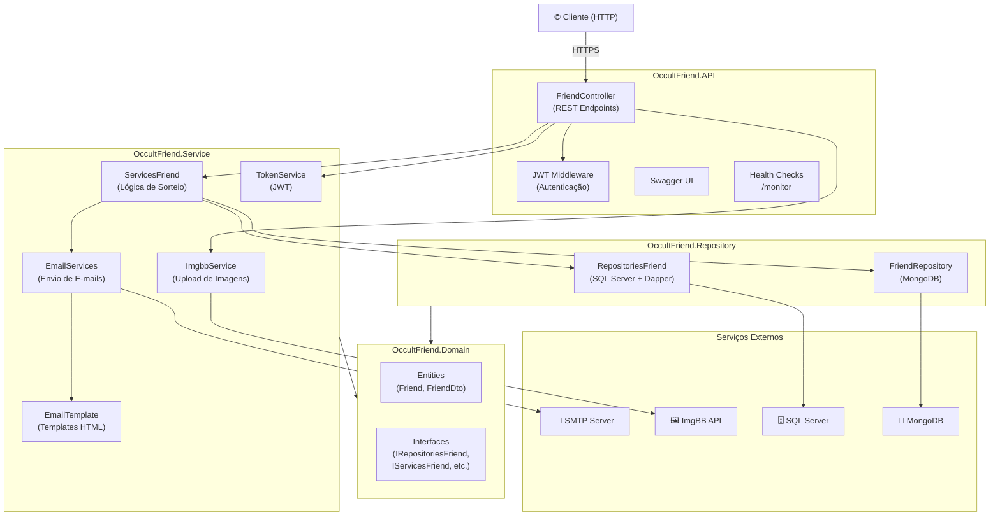
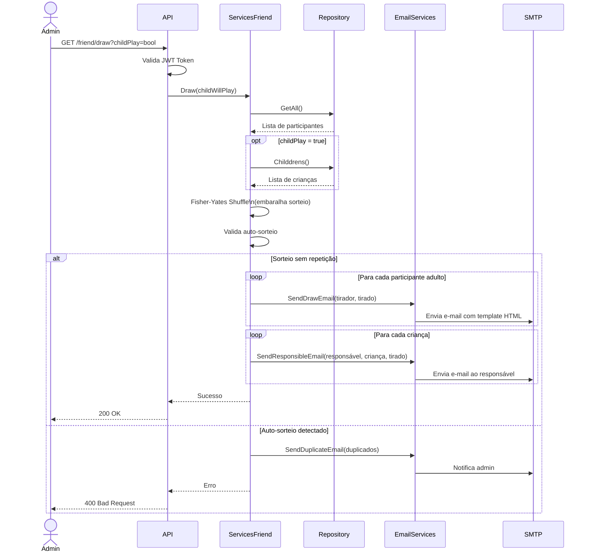
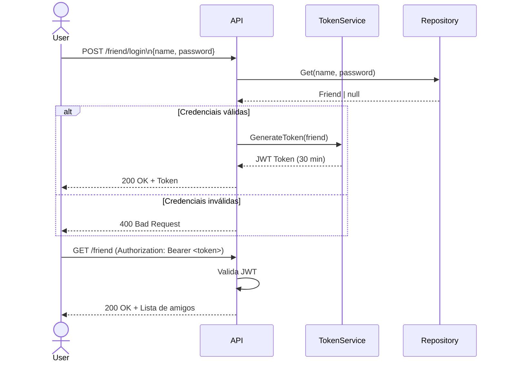
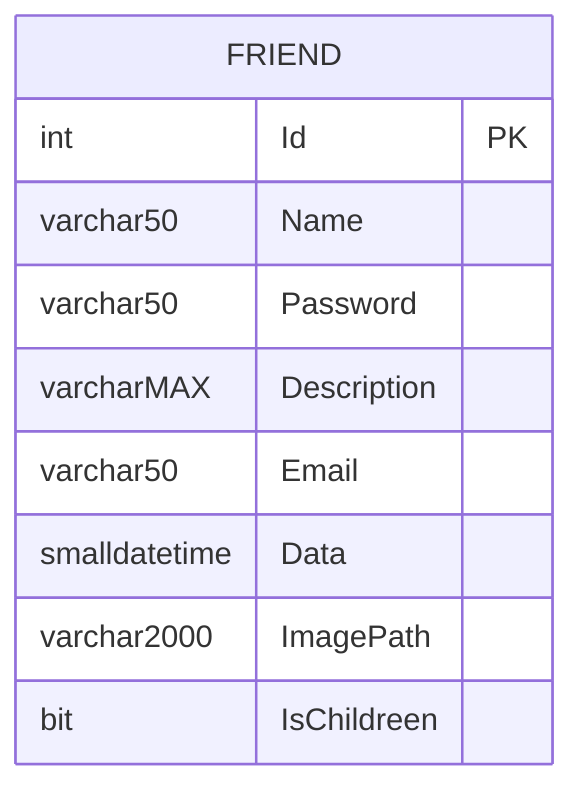
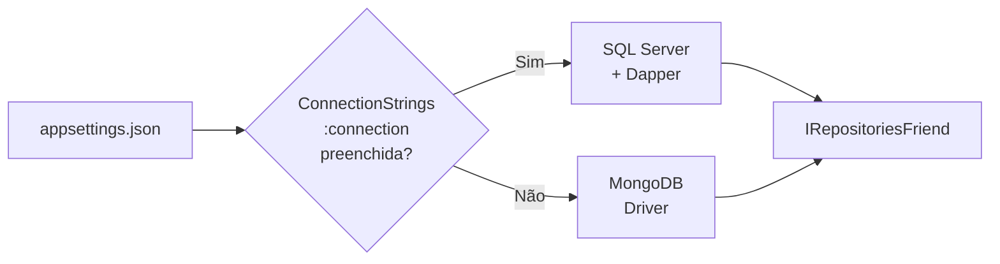

<h1 align="center">🎁 Amigo Oculto API</h1>

  
  
  
  

  Aplicação para gerenciar sorteios de Amigo Oculto com suporte a participantes adultos e crianças, envio de e-mails automáticos e upload de imagens.

---

## Arquitetura

---

## Fluxo do Sorteio

---

## Fluxo de Autenticação

---

## Modelo de Dados

---

## Endpoints da API

| Método | Rota | Auth | Descrição |
|--------|------|------|-----------|
| `POST` | `/friend/login` | Não | Autenticação, retorna JWT |
| `POST` | `/friend` | Não | Cadastro de participante (multipart) |
| `GET` | `/friend` | Sim | Lista todos os participantes |
| `GET` | `/friend/{id}` | Sim | Busca participante por ID |
| `GET` | `/friend/draw?childPlay=bool` | Sim | Executa o sorteio |
| `PUT` | `/friend` | Sim | Atualiza participante |
| `DELETE` | `/friend/{id}` | Sim | Remove participante |
| `GET` | `/monitor` | Não | Health check UI |

---

## Seleção de Banco de Dados

---

## Tecnologias

- [.NET 6.0](https://dotnet.microsoft.com/download/dotnet/6.0)
- [SQL Server 2019 (local)](https://www.microsoft.com/pt-br/sql-server/sql-server-2019)
- [MongoDB (produção)](https://docs.mongodb.com/guides/)
- [Dapper ORM](https://dapper-tutorial.net/step-by-step-tutorial)
- [JWT Bearer Authentication](https://docs.microsoft.com/pt-br/aspnet/core/security/authentication/jwt-authn)
- [ImgBB API](https://api.imgbb.com/)
- [xUnit + Moq (testes)](https://xunit.net/)
- [Swagger / Swashbuckle](https://swagger.io/)
- [Azure Pipelines (CI/CD)](https://azure.microsoft.com/pt-br/products/devops/pipelines)

---

## Autor

<a href="https://github.com/WellingtonKarl">
 
  
 <b>Wellington Karl</b>
</a>

Feito com ❤️ por Wellington Karl 👋🏽

